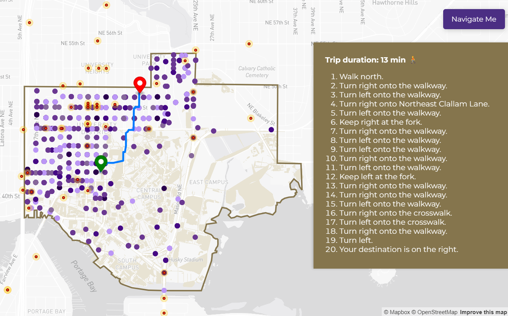

# UW Alert System  

## Project Title  
**UW Alert System: Real-Time Crime and Emergency Reporting Web Map**  

## Project Description  
The **UW Alert System** is an interactive web application designed to provide students, faculty, and visitors with real-time crime and emergency alert data in and around the University of Washington (UW) campus. The application integrates various data sources, including the Seattle Police Department crime data and live 911 emergency reports, and visualizes them on a **Mapbox-powered** interactive map.

The web application gathers and visualizes **crime trends, emergency response activity, and public safety alerts** using an interactive mapping interface. Users can explore:  
- **Live emergency 911 call reports**, updated frequently to reflect ongoing incidents.  
- **Historical crime data**, allowing trend analysis and hotspot identification.  
- **Campus infrastructure and navigation details**, including **buildings, footpaths, and bike lanes** to aid in safe travel planning.  

To ensure **data accuracy and reliability**, the system utilizes and **processes** information from multiple trusted sources:  
- **Seattle Open Data Portal** – Historical crime reports and law enforcement data.  
- **Seattle 911 Call Data API** – Live emergency response reports filtered by incident type.  
- **OpenStreetMap (OSM)** – Detailed geographic and infrastructure data for the UW campus.  

By offering **a centralized safety awareness platform**, the UW Alert System equips students, faculty, and residents with a **real-time situational awareness tool**, fostering a **safer and more informed campus community**.  

---

## Favicon  
  

---

## Project Goal  
The **primary goal** of this project is to improve **public safety awareness** and encourage **proactive decision-making** regarding personal security by **visualizing real-time and historical crime data**. We aim to visualize crime around the University of Washinton area to make it more accessabile rather than reading complicated emails and texts hours after the incident has occured.  

As **students at the University of Washington**, we often receive **crime alert emails** about incidents occurring on or near campus. These alerts cover a broad range of issues, including:  
- **Violent crimes** (assault, robbery, shootings).  
- **Property crimes** (car thefts, vandalism, burglaries).  
- **Other emergency incidents** (fires, EMS calls, disturbances).  

### **Motivation Behind the Project**  
Through our personal experiences, we noticed **several challenges** with the UW Crime Alerts and emergency alerts are distributed:  
- **Emails alone are not an effective way to track ongoing threats.** There is no easy way to **visualize where crime is happening over time**. These notifacations can be sent almost a day after the incident has occured, which is unhelpful if someone has already traveled through that area and could had been at risk.  
- **Crime awareness should be dynamic**, allowing users to visualize and focus on **specific incident types or areas** of concern.  
- **Proactive navigation is needed** – Knowing where crime is occurring allows users to **adjust their travel routes for safety**. The reports being sent can be cofusing since it all comes in the form of text, requiring people who view them to know the exact street that the incident occured or have to look the location up.

### **How This Project Improves Safety**  
- Provides **instant updates** on crimes and emergency incidents occurring near campus.  
- Helps students and faculty **avoid high-risk areas** by providing **safe rerouting options**.  
- Offers an **intuitive, map-based user experience**, making it easy to **analyze crime patterns over time**.  
- Encourages **community-driven safety awareness** by leveraging **open-source data**.  

---

## Application URL  
[UW Alert System](https://vm11962-2131012.github.io/UW_Alert_System/index.html)  

---

## Screenshots  

### **Main Interface**  
  
  

### **Live 911 Emergency Calls**  
  

### **Seattle Police Department Crime Data**  
  

### **Navigation Tool**  
  
 

---

## **Main Functions & Features**  

### ** Live 911 Crime Data **
- Displays **Seattle Police Department (SPD) crime data** from the past year.
- Provides detailed information on crime reports, including **date, time, type, and location**.
- Uses **color-coded markers** to distinguish different crime types.

### ** Live 911 Emergency Alerts **
- Fetches **live 911 call data** for high-risk incidents (e.g., Assaults, Shootings, Robberies, Fires, Bomb Threats).
- Displays **danger zone buffers (35 meters)** around emergency locations to indicate potential risk zones.
- **Filters duplicate reports** and maintains real-time updates every 5 minutes.

### ** Safe Navigation with Rerouting **
- Users can **select start and end points** on the map to generate a **walking route**.
- Routes **avoid crime-prone areas** by detecting if a path intersects with danger zones.
- Displays **turn-by-turn instructions** for navigation.
- Alerts users when a route passes through high-risk areas.

### ** University Campus Map Integration**  
- Detailed **campus buildings, footpaths, and bike lanes** aid in better navigation.  
- Data sourced from **OpenStreetMap (OSM) and Overpass Turbo**.  

### ** Interactive UI with Filtering Options**  
- Users can **toggle data layers** for:  
  - **911 Emergency Calls**  
  - **SPD Crime Reports**  
  - **Campus Navigation Details**  
- **Collapsible sidebars, zoom controls, and a legend** for easy navigation.  

---

## **Data Sources & Processing**  

### **Seattle Police Department (SPD) Crime Data**
- **Source:** SPD Open Data Portal
- **File:** clean_spd_crime_df.geojson
- **Data:** Includes various crime categories such as **theft, vandalism, fraud, and motor vehicle theft**.

### **Live 911 Emergency Call Data**
- **Source:** Seattle Open Data API (https://data.seattle.gov/resource/33kz-ixgy.geojson)
- **Data Processing:** Filters high-priority incidents and maps them with real-time updates.
- **Buffer Zones:** 35m radius around emergency locations using **Turf.js**.

### **UW Campus Data**
- **Source:** OpenStreetMap (OSM)
- **File:** uw_osm.geojson
- **Data:** Provides geographic boundaries of the UW campus.

### **University of Washington Boundary**
- **File:** uw_boundary.geojson
- **Data:** Defines the campus perimeter for filtering crime data within UW.
---

## **Technologies & Libraries Used**  
- **Mapbox GL JS** – For interactive web-based mapping.  
- **OpenStreetMap (OSM)** – Navigation and infrastructure data.  
- **Seattle Open Data API** – Live crime and emergency data.  
- **Overpass Turbo** – Querying geographic campus details.  
- **Python (Pandas, Geopandas)** – Data processing & cleaning.  
- **Jupyter Notebook** – Data transformation & GeoJSON conversion.  
- **Turf.js** – Geospatial analysis & filtering.  
- **Font Awesome** – UI enhancements & icons.  

---

## **Acknowledgments**  
We would like to thank:  
- **Seattle Open Data Initiative** for **public crime & emergency data**.  
- **OpenStreetMap (OSM) Community** for providing **detailed mapping resources**.  
- **GitHub** for hosting the project repository.  
- **Mapbox** for their powerful mapping technologies.  

---

## **AI Use Disclosure**  
We used **GitHub Copilot & ChatGPT** for:  
- **Debugging JavaScript & Python code**.  
- **Refining data processing scripts** for real-time updates.  
- **Structuring documentation & improving readability**.  

---

## **GitHub Repository**  
[GitHub Repository](https://github.com/vm11962-2131012/UW_Alert_System.git)  

---

## **Additional Notes**  
- This project is **open-source** and welcomes contributions.  
- **Data Limitations:** Emergency updates are **real-time** but may experience slight reporting delays.  
- Always verify urgent incidents through **official UW safety channels**.  

