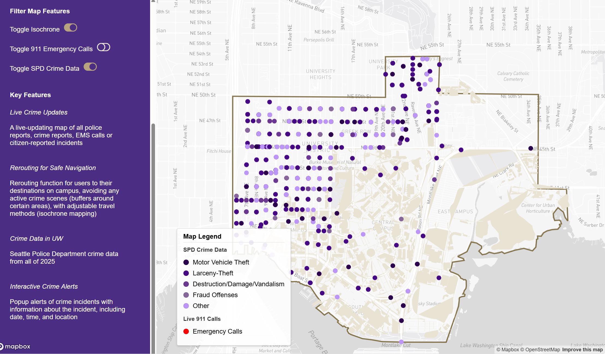

# UW Alert System  

## Project Title  
**UW Alert System: Real-Time Crime and Emergency Reporting Web Map**  

## Project Description  
The **UW Alert System** is a **dynamic, real-time crime and emergency reporting web map** designed to enhance **public safety awareness** around the **University of Washington (UW) campus**. By integrating live **Seattle 911 emergency calls, historical crime reports, and detailed campus navigation data**, this platform enables users to stay informed and make **data-driven decisions about their safety**.  

The web application gathers and visualizes **crime trends, emergency response activity, and public safety alerts** using an interactive mapping interface. Users can explore:  
- **Live emergency 911 call reports**, updated frequently to reflect ongoing incidents.  
- **Historical crime data**, allowing trend analysis and hotspot identification.  
- **Campus infrastructure and navigation details**, including **buildings, footpaths, and bike lanes** to aid in safe travel planning.  

To ensure **data accuracy and reliability**, the system **ingests** and **processes** information from multiple trusted sources:  
- **Seattle Open Data Portal** – Historical crime reports and law enforcement data.  
- **Seattle 911 Call Data API** – Live emergency response reports filtered by incident type.  
- **OpenStreetMap (OSM)** – Detailed geographic and infrastructure data for the UW campus.  

By offering **a centralized safety awareness platform**, the UW Alert System equips students, faculty, and residents with a **real-time situational awareness tool**, fostering a **safer and more informed campus community**.  

---

## Favicon  
  

---

## Project Goal  
The **primary goal** of this project is to improve **public safety awareness** and encourage **proactive decision-making** regarding personal security by **visualizing real-time and historical crime data**.  

As **students at the University of Washington**, we often receive **crime alert emails** about incidents occurring on or near campus. These alerts cover a broad range of issues, including:  
- **Violent crimes** (assault, robbery, shootings).  
- **Property crimes** (car thefts, vandalism, burglaries).  
- **Other emergency incidents** (fires, EMS calls, disturbances).  

### **Motivation Behind the Project**  
Through our personal experiences, we noticed **several challenges** with the way crime and emergency alerts are distributed:  
- **Emails alone are not an effective way to track ongoing threats.** There is no easy way to **visualize where crime is happening over time**.  
- **Crime awareness should be dynamic**, allowing users to **interactively filter reports** and focus on **specific incident types or areas** of concern.  
- **Proactive navigation is needed** – Knowing where crime is occurring allows users to **adjust their travel routes for safety**.  

### **How This Project Improves Safety**  
- Provides **instant updates** on crimes and emergency incidents occurring near campus.  
- Helps students and faculty **avoid high-risk areas** by providing **safe rerouting options**.  
- Offers an **intuitive, map-based user experience**, making it easy to **analyze crime patterns over time**.  
- Encourages **community-driven safety awareness** by leveraging **open-source data**.  

---

## Application URL  
[UW Alert System](https://vm11962-2131012.github.io/UW_Alert_System/index.html)  

---

## Screenshots  

### **Main Interface**  
  

### **Feature Overview**  
  

### **Live 911 Emergency Calls**  
  

### **Seattle Police Department Crime Data**  
  

---

## **Main Functions & Features**  

### ** Live 911 Emergency Reports**  
- Displays **real-time emergency calls** from **Seattle 911 Dispatch**.  
- Users can view incident locations, timestamps, and **call types** (assault, robbery, fire, medical emergencies).  

### ** Crime Data Visualization**  
- **Historical crime reports** from **SPD crime data (2024-Present)** allow users to analyze crime trends.  
- Interactive crime markers **color-coded by offense type** help identify crime hotspots.  

### ** Safe Route Navigation & Isochrone Mapping**  
- **Avoid high-crime areas** by dynamically **rerouting paths** to safer routes.  
- Uses **isochrone mapping** to show **walkable or bike-friendly paths** away from unsafe zones.  

### ** University Campus Map Integration**  
- Detailed **campus buildings, footpaths, and bike lanes** aid in better navigation.  
- Data sourced from **OpenStreetMap (OSM) and Overpass Turbo**.  

### ** Interactive UI with Filtering Options**  
- Users can **toggle data layers** for:  
  - **911 Emergency Calls**  
  - **SPD Crime Reports**  
  - **Campus Navigation Details**  
- **Collapsible sidebars, zoom controls, and a legend** for easy navigation.  

---

## **Data Sources & Processing**  

### ** Seattle Police Department (SPD) Crime Data**  
- **Pulled from the Seattle Open Data Portal** covering **2024-present**.  
- Data **filtered & processed** in **Python (pandas, geopandas)** to extract relevant incidents.  
- Converted from **CSV to GeoJSON** for seamless integration into **Mapbox GL JS**.  

### ** Live 911 Call Data API**  
- Direct API connection to **Seattle’s emergency dispatch system**.  
- Data **filtered** for incidents **affecting UW and nearby areas**.  
- Extracted **incident types, timestamps, and locations** for better context.  

### ** UW Campus Navigation Data**  
- **Queried from OpenStreetMap (OSM)** using **Overpass Turbo**.  
- Extracted **campus buildings, pathways, and bike routes** for navigation.  

---

## **Technologies & Libraries Used**  
- **Mapbox GL JS** – For interactive web-based mapping.  
- **OpenStreetMap (OSM)** – Navigation and infrastructure data.  
- **Seattle Open Data API** – Live crime and emergency data.  
- **Overpass Turbo** – Querying geographic campus details.  
- **Python (Pandas, Geopandas)** – Data processing & cleaning.  
- **Jupyter Notebook** – Data transformation & GeoJSON conversion.  
- **Turf.js** – Geospatial analysis & filtering.  
- **Font Awesome** – UI enhancements & icons.  

---

## **Acknowledgments**  
We would like to thank:  
- **Seattle Open Data Initiative** for **public crime & emergency data**.  
- **OpenStreetMap (OSM) Community** for providing **detailed mapping resources**.  
- **GitHub** for hosting the project repository.  
- **Mapbox** for their powerful mapping technologies.  

---

## **AI Use Disclosure**  
We used **GitHub Copilot & ChatGPT** for:  
- **Debugging JavaScript & Python code**.  
- **Refining data processing scripts** for real-time updates.  
- **Structuring documentation & improving readability**.  

---

## **GitHub Repository**  
[GitHub Repository](https://github.com/vm11962-2131012/UW_Alert_System.git)  

---

## **Additional Notes**  
- This project is **open-source** and welcomes contributions.  
- **Data Limitations:** Emergency updates are **real-time** but may experience slight reporting delays.  
- Always verify urgent incidents through **official UW safety channels**.  

